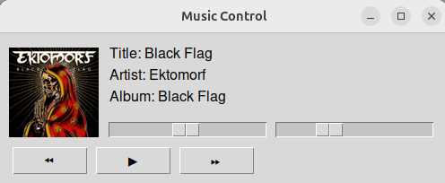

# Simple MPRIS Music Controller

## Introduction

Hey there! 👋

I was on the lookout for a simple application to control music players via MPRIS. I often work with music playing in the background and wanted a small window to display the currently playing track from my browser without the hassle of searching for the tab or switching windows.

After some searching, I couldn't find anything that fit my needs. So, I asked GPT to write a script for me. With a few more prompts and refinements, I ended up with this script.

This script utilizes `playerctl` for media control and `pactl` for volume control. Make sure these packages are installed on your system.

## Features

- Display the currently playing track
- Display album art
- Show music progress
- Play/Pause control
- Next/Previous track control
- Volume control

## Screenshots


I also left the original GPT prompt in the screenshots folder. You can check it out to see how the script evolved (Sorry, those are in portuguese).

## Compatibility

This script should be compatible with the major music players that support MPRIS on Ubuntu, such as:

- VLC
- Rhythmbox
- Clementine
- MPV
- Audacious

It also works with popular music services that support MPRIS, including:

- Apple Music
- Spotify
- Google Play Music
- YouTube Music (when played via a browser that supports MPRIS, such as Chrome or Firefox)


## Requirements

Ensure the following packages are installed:

- `playerctl`
- `pactl`

You can install them using:

```bash
sudo apt install playerctl pulseaudio-utils
```

## Installation

1. Clone this repository:

```bash
git clone https://github.com/eduardogsilva/music-control.git
```

2. Navigate to the project directory:

```bash
cd music-control
```

3. Install the required Python packages:

```bash
pip install -r requirements.txt
```

4. Run the script:

```bash
python3 music-control.py
```

## Usage

- A small window will appear showing the currently playing track.
- Album art and music progress are displayed.
- Use the provided buttons to play/pause, skip to the next or previous track.
- Adjust the volume using the volume slider.

## Customization

Feel free to customize the script to better suit your needs. If you have any suggestions or improvements, feel free to open an issue or submit a pull request!

## Contributing

Contributions are welcome! Please fork this repository and submit a pull request with your changes.

## License

This project is licensed under the MIT License.

## Acknowledgements

Big thanks to GPT for building this script.

Enjoy your music and happy coding! 🎶

